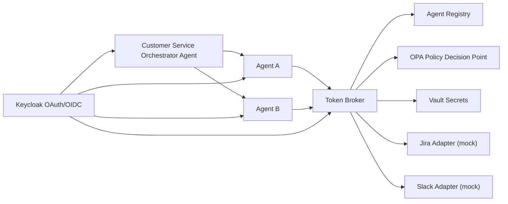

# Agentic OAuth Platform (OSS Reference)

A centralized, open-source reference platform for **non-human identity**, **OAuth token governance**, and **policy-controlled agent access** across enterprise services (e.g., Jira, Slack) for MCP-enabled systems.

## Architecture at a glance

Start with the full architecture in [`docs/architecture.md`](docs/architecture.md).  
Quickstart instructions live in [`docs/README.md`](docs/README.md).



### Techniques this reference is meant to compare

The design discussion behind this repository surfaced several complementary techniques rather than a single winner:

- **Static service accounts / pre-registered OIDC clients** are still the fastest enterprise path when an IdP already supports machine identities, custom scopes, and claim-based authorization. They work well for both humans and non-human identities, but they can create friction when client registration and claim changes are centrally controlled.
- **OAuth 2.1 security defaults** should be treated as the baseline regardless of the client type: Authorization Code + PKCE, exact redirect URI matching, no implicit flow, no password grant, short-lived tokens, and careful refresh-token handling.
- **Dynamic Client Registration (DCR)** is useful when MCP clients need to register themselves with the authorization server instead of being pre-registered one by one. That reduces manual setup, but support varies by IdP, product edition, and enterprise policy.
- **Client ID Metadata Documents (CIMD)** are attractive for portable MCP clients because the client identity is an HTTPS metadata document that publishes redirect URIs, supported grants, and JWKS material. This reduces per-server secret sprawl and fits cases where one agent or client needs to talk to many MCP servers.
- **Two-layer OAuth** is often required in practice: one trust relationship from agent/client to the MCP server, and another from the MCP server or broker to downstream systems like Jira or Slack. Those scopes may align, but they are not always identical.
- **Central broker + policy + capability mapping** is the pattern this repo emphasizes. Agents declare internal capabilities such as `jira.read.issues` or `slack.read.channels`; a broker consults registry data and policy, then issues or exchanges short-lived downstream access. That creates a paved road for developers without forcing every agent to copy-and-paste provider-specific OAuth logic.

In other words, the practical architecture is not “pick only DCR” or “pick only service accounts.” It is to keep a centralized control plane, use OAuth 2.1 defaults everywhere, support DCR or CIMD where portable MCP client registration is needed, and normalize downstream access through policy-governed capability-to-scope mapping.

This project demonstrates how to move from ad-hoc per-agent credentials to a central control plane where:

- Agents declare what they need (`jira.read.issues`, `slack.read.channels`)
- Policies decide what is allowed
- Token issuance is brokered centrally
- Secrets are managed in one place
- Orchestrator agents can delegate work to specialized agents with constrained permissions

---

## Why this project exists

Modern agentic architectures often accumulate unmanaged credentials and over-privileged integrations.  
This platform provides a concrete, runnable pattern to solve that with OSS components:

- **Identity authority** for machine identities
- **Agent registry** for capability declarations
- **Policy engine** for deterministic authorization decisions
- **Token broker** for normalized, auditable token issuance
- **Secret manager** for provider credentials
- **Orchestrator pattern** to coordinate multi-agent workflows safely

---

## What is included

- **Keycloak** (OAuth2/OIDC authority for service accounts)
- **OPA** (policy decision point)
- **Vault** (secret storage)
- **Agent Registry** (Python/FastAPI; capability declarations)
- **Token Broker** (Python/FastAPI; policy + capability-to-scope mapping + token issuance mock)
- **Agent A** (Jira read-only behavior)
- **Agent B** (Slack read-only behavior)
- **Customer Service Orchestrator Agent** (aggregates A/B results)
- **MCP registry metadata** (open-source friendly local registry file)

---

## Core demo scenarios

1. **Agent A can request only Jira read-only**
   - Allowed: `jira.read.issues`
   - Denied: `slack.read.channels`

2. **Agent B can request only Slack read-only**
   - Allowed: `slack.read.channels`
   - Denied: `jira.read.issues`

3. **Orchestrator coordinates Agent A + Agent B**
   - Sends one query
   - Receives aggregated answer from both specialized agents
   - Demonstrates centralized token governance model

---

## Repository layout

```text
.
├─ docker-compose.yml
├─ .env.example
├─ Makefile
├─ docs/
│  ├─ architecture.md
│  └─ README.md
├─ infra/
│  ├─ keycloak/        # realm bootstrap/import
│  ├─ opa/             # policy and policy data
│  └─ vault/           # seed script
├─ mcp/
│  └─ registry/        # local MCP registry metadata
└─ services/
   ├─ agent-registry/
   ├─ token-broker/
   ├─ orchestrator-agent/
   ├─ agent-a/
   └─ agent-b/
```

---

## Quick start

### Prerequisites

- Docker + Docker Compose plugin
- curl
- (optional) jq for pretty JSON

### Start stack

```bash
cp .env.example .env
make up
make seed
```

### Health checks

```bash
curl -s http://localhost:8001/health
curl -s http://localhost:8002/health
curl -s http://localhost:8003/health || true
curl -s http://localhost:8004/docs >/dev/null && echo "agent-a up"
curl -s http://localhost:8005/docs >/dev/null && echo "agent-b up"
```

---

## How to use

### 1) Agent A (Jira read-only) — expected ALLOW

```bash
curl -s -X POST http://localhost:8004/jira-read \
  -H "Content-Type: application/json" \
  -d {query:open incidents}
```

### 2) Agent A asking Slack scope — expected DENY (403)

```bash
curl -i -s -X POST http://localhost:8002/token/request \
  -H "Content-Type: application/json" \
  -d agent_id:agent-a
```

### 3) Agent B (Slack read-only) — expected ALLOW

```bash
curl -s -X POST http://localhost:8005/slack-read \
  -H "Content-Type: application/json" \
  -d {query:customer messages}
```

### 4) Orchestrator aggregated answer

```bash
curl -s -X POST http://localhost:8003/answer \
  -H "Content-Type: application/json" \
  -d {question:What is customer ACME status?}
```

---

## Security model (reference)

- **Deny-by-default authorization**
- **Capability-driven access** (internal capabilities map to provider scopes)
- **Short-lived brokered tokens** (demo currently mocked)
- **Centralized policy decisions in OPA**
- **Secrets in Vault**
- **Machine identity via OAuth/OIDC service accounts**

---

## What this is (and isn’t)

### This project is

- A practical local reference architecture
- A foundation for enterprise hardening
- A clear separation of policy, identity, and token issuance concerns

### This project is not (yet)

- Production hardened
- Complete DCR lifecycle implementation
- Full real downstream OAuth integrations with Jira/Slack tenants
- HA setup, full observability, or DR blueprint

---

## Enterprise extension path (high level)

See detailed mapping in `docs/architecture.md` under **Enterprise stack options**.

Typical migration path:

1. Keep architecture boundaries (registry / broker / policy / secrets / IdP)
2. Replace mocked provider adapters with real OAuth integrations
3. Add token exchange, approvals, and full audit trails
4. Add production controls (mTLS, SIEM export, SLOs, key rotation, JIT access)

---

## Developer workflow

```bash
make up
make logs
make seed
make down
```

---

## Troubleshooting

- If broker denies expected capabilities, verify:
  - `infra/opa/data/permissions.json`
  - `infra/opa/policies/authz.rego`
  - `agent_id` and `capability` values in request
- If Vault seed fails:
  - ensure Vault is running first
  - rerun `make seed`
- If Keycloak realm not imported:
  - recreate container: `docker compose down -v && docker compose up -d --build`

---

## Next recommended improvements

- Replace in-memory Agent Registry with persistent DB + migrations
- Add authenticated service-to-service identity validation in broker
- Implement OAuth token exchange flow (RFC 8693)
- Add richer policy model (risk tier, environment, time-based constraints)
- Add test suite (unit/integration/policy conformance)
- Add OpenAPI contracts and SDK generation

