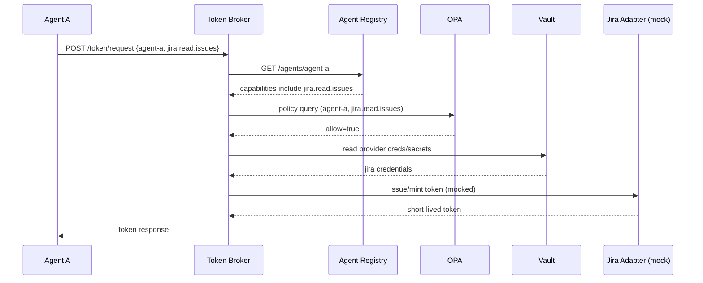
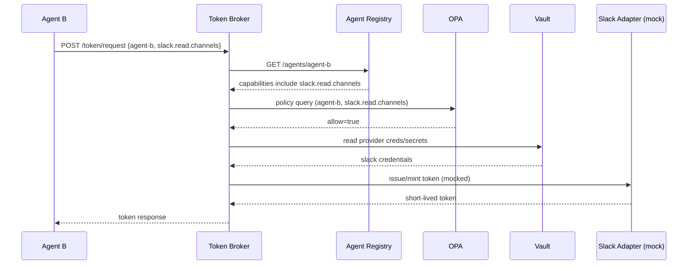
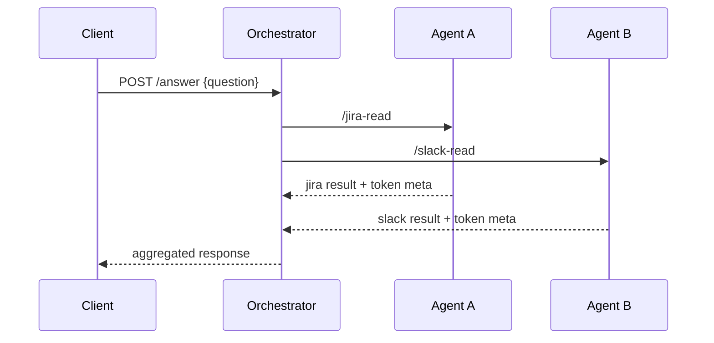

# Architecture

## 1) Platform intent

This platform centralizes how machine/agent identities obtain downstream access tokens.  
Instead of each agent storing provider credentials directly, a **Token Broker** mediates all requests using:

1. Agent identity
2. Declared capability intent
3. Central policy decision
4. Secret-backed adapter execution

---

## 2) High-level component diagram

```mermaid
flowchart LR
  O[Customer Service Orchestrator Agent] --> A[Agent A]
  O --> B[Agent B]

  A --> T[Token Broker]
  B --> T

  T --> R[Agent Registry]
  T --> P[OPA Policy Decision Point]
  T --> V[Vault Secrets]
  T --> J[Jira Adapter (mock)]
  T --> S[Slack Adapter (mock)]

  K[Keycloak OAuth/OIDC] --> T
  K --> O
  K --> A
  K --> B
```

---

## 3) Request sequence: Agent A gets Jira read-only token



---

## 4) Request sequence: Agent B gets Slack read-only token



---

## 5) Request sequence: Orchestrator coordinates A/B



---

## 6) Why each selected OSS tool was chosen

### Keycloak (OAuth2/OIDC authority)

**Decision rationale**
- Mature OSS IAM with broad OAuth2/OIDC support
- Good local/dev ergonomics with realm import
- Supports service accounts for machine identities

**What it does here**
- Issues identity context for services (future: enforced broker authn)
- Provides central identity authority for agent workloads

**Tradeoffs**
- Operational complexity increases at scale
- Advanced enterprise governance may require additional tooling/processes

---

### OPA (Open Policy Agent)

**Decision rationale**
- Decouples authorization policy from service code
- Deterministic policy-as-code model with Rego
- Easy local integration over REST API

**What it does here**
- Enforces capability authorization:
  - Agent A -> Jira read-only only
  - Agent B -> Slack read-only only
  - Deny by default

**Tradeoffs**
- Rego learning curve
- Requires policy lifecycle and testing discipline

---

### Vault (secrets management)

**Decision rationale**
- Widely used OSS secret manager
- Centralized secret retrieval model
- Strong path to production-grade secret governance

**What it does here**
- Stores provider credentials/secrets used by broker adapters
- Avoids secret sprawl in agent services

**Tradeoffs**
- Production deployment needs HA/storage/unseal planning
- Access policy hardening required in real environments

---

### Agent Registry (custom OSS service)

**Decision rationale**
- Need a central source of truth for:
  - agent metadata
  - declared capabilities
  - ownership/risk context
- Lightweight custom service keeps data model explicit and evolvable

**What it does here**
- Stores agent definitions and declared capability intents
- Queried by broker prior to policy decision

**Tradeoffs**
- Needs persistence and schema evolution in future versions
- Eventually needs authz/audit and admin workflows

---

### Token Broker (custom OSS service)

**Decision rationale**
- Central control point is required for consistent governance
- Encapsulates capability normalization and provider adapter logic
- Enables auditable, policy-enforced issuance decisions

**What it does here**
- Validates requests
- Reads registry
- Calls OPA
- Pulls secrets from Vault
- Issues provider token (mock in this scaffold)

**Tradeoffs**
- Becomes critical dependency; needs HA and resilience in production
- Must be strongly authenticated and monitored

---

### MCP registry metadata (open-source local integration)

**Decision rationale**
- Need discoverability for agent/tool metadata
- Local JSON registry provides simple OSS-friendly bootstrap

**What it does here**
- Declares available agents and capabilities
- Serves as integration anchor for MCP-compatible control plane evolution

**Tradeoffs**
- Static file approach is not dynamic registry management
- Needs API-backed registry for larger ecosystems

---

## 7) Enterprise stack options (component-by-component)

Below are practical enterprise alternatives while preserving this architecture.

### Identity provider / OAuth authority
- **OSS default:** Keycloak
- **Enterprise options:** Okta, Auth0, Microsoft Entra ID, Ping Identity, ForgeRock, Curity

### Policy engine
- **OSS default:** OPA
- **Enterprise options:** Styra DAS (OPA enterprise), Aserto, AWS Cedar-based internal policy services, in-platform policy engines from API gateways

### Secrets management
- **OSS default:** Vault OSS
- **Enterprise options:** Vault Enterprise, AWS Secrets Manager, Azure Key Vault, Google Secret Manager, CyberArk Conjur

### Agent registry
- **OSS default:** Custom FastAPI service + DB
- **Enterprise options:** Backed by PostgreSQL + admin portal; or governance catalog platforms with API integration (internal developer platform catalogs)

### Token broker
- **OSS default:** Custom FastAPI broker
- **Enterprise options:** Curity token service patterns, Ping token mediation, custom gateway-based broker on Kong/Apigee/NGINX + policy hooks

### Provider integration layer
- **OSS default:** Adapter mocks (Jira/Slack mock)
- **Enterprise options:** Real OAuth app integrations per provider, centralized consent/approval workflows, token exchange services

### Audit and observability
- **OSS baseline:** service logs + OPA decision logs
- **Enterprise options:** Datadog/Splunk/ELK/SIEM integration, immutable audit pipelines, anomaly detection

### Workload identity
- **OSS options:** Keycloak service accounts, SPIFFE/SPIRE
- **Enterprise options:** cloud workload identities (AWS/GCP/Azure), service mesh identity (Istio/Linkerd variants)

---

## 8) Security and governance principles

1. **Deny by default**
2. **Least privilege by capability intent**
3. **Short-lived tokens**
4. **No direct provider credentials in agents**
5. **Central policy + central audit**
6. **Explicit ownership and risk tier per agent**

---

## 9) Gaps to production readiness

- Enforce strong service authentication to broker (mTLS/JWT validation)
- Replace in-memory registry with durable DB + migrations
- Full audit event model (who/what/why/decision)
- Retry/circuit breaker semantics in broker adapters
- Rate limiting, abuse prevention, and quotas
- SLOs, tracing, and incident runbooks
- Key rotation and secret rotation automation
- Optional DCR and token exchange flows (RFC 7591/7592, RFC 8693)

---

## 10) Suggested roadmap

### Phase 1 (current)
- Local compose stack
- Policy-enforced capability demo
- Mock provider issuance

### Phase 2
- Real provider integrations (Jira/Slack OAuth apps)
- Persistent registry + admin APIs
- Structured audit logs

### Phase 3
- Enterprise IdP integration
- Token exchange and approval workflows
- Multi-environment governance controls

