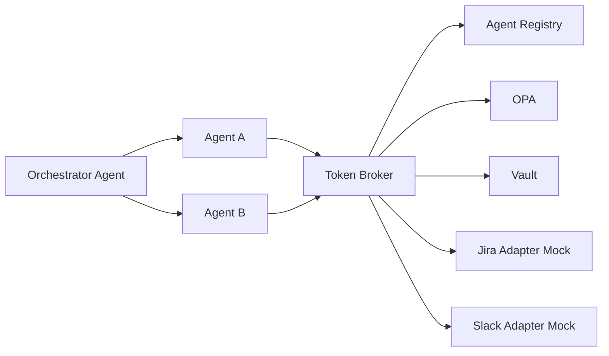

# Architecture

## Policies
- Agent A -> allowed only `jira.read.issues`
- Agent B -> allowed only `slack.read.channels`
- Orchestrator can call A/B but should not directly request broad downstream scopes.

## Trust boundaries
- Internal network between services
- Token broker is central control point
- OPA is decision point
- Vault stores secrets and provider creds
